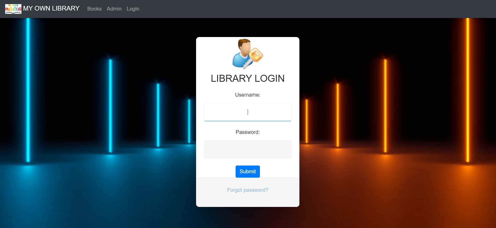
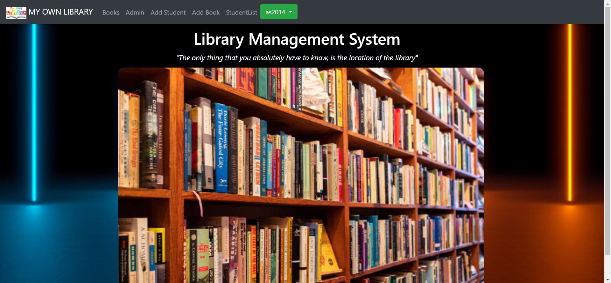

# Library-Management-System-using-Django

This project Library Management System which has been developed on Python, Django and SQlite. The current Library Management System
Project in Python does not eliminate the process of searching books within the library campus. Students have to find books manually. They have to
wait until they are not provided with their library card and token. For receiving book they have to show their library card and wait in line for their turns.
The admin personnel also have to look manually on which day which person will take the charge within library to manage the overall work. The project
library management system is capable to store all the information in the database from where user will place their query and get the results on the basis
of their query. Only valid users will be able to access this Library Management System. Through this Books and Library Management System it will be
easy to manage accounts and various details of particular student and employees working under library along with the records of books.

## How to Run

- Cloning the Repository: 

        git clone https://github.com/am9964/Library-Management-System-using-Django
        
- Entering the directory: 

        cd Library-Management-System-using-Django
        
- Setting up the Python Environment with dependencies:

        pip install -r requirements.txt

- Running the file:

        python manage.py runserver
        
 Now go to http://127.0.0.1:8000/ to see the web application.
 
 ## Demonstration
 
 
  
  
  

## Contributors

- [Ankit Mathur](https://github.com/am9964)
- [Adarsh Srivastava](https://github.com/theAdarshSrivastava)
 
